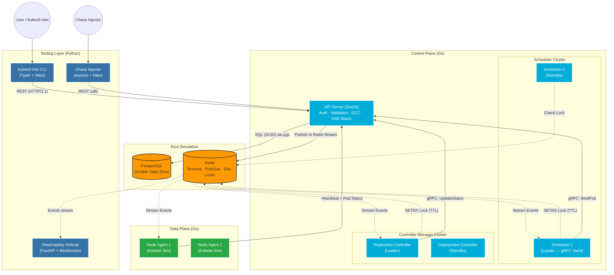

# Architecture Design — Go + Python Hybrid

## System Overview

This project simulates a **production-grade Kubernetes Control Plane** using a **Go + Python hybrid** architecture. Go owns the critical control plane path (performance, concurrency, correctness). Python owns tooling, scripting, and human-facing layers.

**Core Design Principles:**
1. **Hub-and-Spoke Topology**: All components communicate *only* via the API Server.
2. **Event-Driven & Level-Triggered**: Components react to state changes but reconcile towards desired state.
3. **Optimistic Concurrency**: No global locks — use `resourceVersion` and Compare-And-Swap.
4. **High Availability Ready**: HA-capable via Redis-based Leader Election on Scheduler and Controllers.
5. **Language Separation**: Go = control plane runtime. Python = operator tooling layer.

---

## Component Language Map

```
┌─────────────────────────────────────────────────────────────────┐
│  GO (Control Plane)                                             │
│  ┌──────────────┐  ┌─────────────┐  ┌──────────────────────┐  │
│  │  API Server   │  │  Scheduler  │  │  Controller Manager  │  │
│  │  (chi/net http)│  │  (gRPC cli) │  │  (goroutine loops)   │  │
│  └──────┬───────┘  └──────┬──────┘  └──────────┬───────────┘  │
│         │                  │                     │              │
│  ┌──────┴──────────────────┴─────────────────────┴──────────┐  │
│  │              Node Agent / Kubelet Sim (Go)                │  │
│  └───────────────────────────────────────────────────────────┘  │
└─────────────────────────────────────────────────────────────────┘

┌─────────────────────────────────────────────────────────────────┐
│  PYTHON (Operator / Tooling Layer)                              │
│  ┌──────────────────┐   ┌──────────────────────────────────┐   │
│  │  kubectl-mini CLI │   │  Chaos Injector + Observability  │   │
│  │  (Typer + httpx)  │   │  (asyncio + FastAPI + WebSocket) │   │
│  └──────────────────┘   └──────────────────────────────────┘   │
└─────────────────────────────────────────────────────────────────┘
```

---

## System Diagram



---

## Detailed Component Breakdown

### 1. API Server — Go

**Stack**: Go + `chi` router + `pgx` (Postgres) + `go-redis` + `golang-jwt/jwt`

**Responsibilities:**
- Accept REST requests from `kubectl-mini` (Python CLI) and controllers.
- Validate, authenticate (JWT), and persist resources to Postgres.
- Publish `(EventType, Object)` to Redis Stream `k8s:events` on every write.
- Expose `GET /api/v1/watch/{resource}` — long-lived SSE endpoint backed by Redis consumer groups.
- Expose `gRPC` server for `BindPod` and `UpdateStatus` calls from Scheduler/Controllers.

**Optimistic Concurrency:**
- Every object carries `resourceVersion` (monotonic integer).
- On `PUT`/`PATCH`, SQL `WHERE resource_version = $requested_version` → if 0 rows updated → `409 Conflict`.

**Go Patterns Used:**
- `context.Context` threading for request cancellation.
- Middleware chain: logging → auth → rate-limit → handler.
- Goroutines per SSE client, cleaned up via `context.WithCancel`.

---

### 2. Scheduler — Go

**Stack**: Go + gRPC client + `go-redis` + Redis distributed lock

**Informer Pattern:**
1. **List**: `GET /api/v1/pods?fieldSelector=status.phase=Pending` → populate local cache.
2. **Watch**: Subscribe to Redis Stream from `latest_resource_version`.
3. **Cache**: `sync.RWMutex`-protected `map[string]*Pod`.
4. **Reconcile**: Pick unscheduled pods → run scoring → gRPC `BindPod` to API Server.

**Scheduling Algorithms (interface-based for easy swapping):**
```go
type Scheduler interface {
    Score(pod *Pod, nodes []*Node) *Node
}
// Implementations: RoundRobin, BinPack
```

**Leader Election:**
- `SETNX k8s:leader:scheduler <instanceID> EX 15` — only leader runs scheduling loop.
- Standby instance polls every 5s.

---

### 3. Controller Manager — Go

**Stack**: Go + goroutines + buffered channels + gRPC client

**ReplicaSet Controller:**
- Watch `ReplicaSet` and `Pod` objects.
- If `running_count < desired_replicas` → POST new pods to API Server.
- If `running_count > desired_replicas` → DELETE excess pods.

**Work Queue Pattern:**
```go
workQueue := make(chan string, 100) // buffered channel — like client-go workqueue
go func() {
    for key := range workQueue { reconcile(key) }
}()
```

**Resync Loop (Level-Triggered):**
- Even without events, re-list all objects every 30s to catch missed events.

---

### 4. Node Agent (Kubelet Simulator) — Go

**Stack**: Go + Docker SDK (`docker/docker/client`) + goroutines

**Loops (all concurrent goroutines):**
- **Registration**: one-shot POST on startup.
- **Heartbeat**: `time.Ticker` every 10s → PUT `/api/v1/nodes/{id}/status`.
- **Pod Watch**: SSE stream → apply pod spec → transition states.
- **Lifecycle State Machine**: `Pending → ContainerCreating → Running → Succeeded/Failed`.

**Docker Integration**: Uses Docker SDK to call `docker run`/`docker stop` for real container simulation.

---

### 5. kubectl-mini CLI — Python

**Stack**: Python + `Typer` + `httpx` + `rich` + `PyYAML`

**Commands:**
```
kubectl-mini get pods
kubectl-mini get nodes
kubectl-mini apply -f pod.yaml
kubectl-mini describe pod <name>
kubectl-mini get pods --watch          # SSE streaming
kubectl-mini delete pod <name>
```

**Config file** `~/.mini-kube/config.yaml`:
```yaml
server: http://localhost:8080
token: <jwt_token>
```

**Python Patterns Used**: Typer decorators, `httpx.AsyncClient`, `rich.Table`, YAML parsing, `asyncio` for `--watch`.

---

### 6. Chaos Injector + Observability — Python

**Stack**: Python + `asyncio` + `httpx` + `FastAPI` + WebSockets + `PyYAML`

**Chaos Injector:**
- Reads a YAML scenario file:
```yaml
scenarios:
  - action: kill_node
    target: node-1
    after: 30s
  - action: kill_pods
    selector: app=nginx
    count: 3
    after: 60s
```
- Executes using `asyncio.sleep` + `httpx.AsyncClient`.

**Observability Sidecar (FastAPI):**
- Subscribes to Redis Stream `k8s:events`.
- Exposes `/ws/events` WebSocket → pushes events to any connected browser.
- Exposes `GET /metrics` → summary stats (pod counts by phase, node counts, event rates).

---

## Data Flow: Pod Creation End-to-End

```
kubectl-mini apply -f pod.yaml
        │  (Python httpx POST)
        ▼
API Server (Go)
  ├── Validate & Auth (JWT middleware)
  ├── Write to Postgres (INSERT pods ... RETURNING resource_version)
  └── Publish to Redis Stream k8s:events
              │
              ├──► Scheduler (Go) receives ADDED event
              │      └── Scores nodes → gRPC BindPod → API Server writes nodeName
              │
              ├──► Node Agent (Go) receives MODIFIED event (pod.spec.nodeName = "node-1")
              │      └── docker run ... → Update pod.status.phase = Running
              │
              └──► Observability Sidecar (Python) streams event to dashboard WebSocket
```

---

## Repository Structure

```
mini_k8s/
├── cmd/
│   ├── apiserver/         # Go — main.go for API Server
│   ├── scheduler/         # Go — main.go for Scheduler
│   ├── controller-manager/ # Go — main.go for Controller Manager
│   └── node-agent/        # Go — main.go for Node Agent
├── internal/
│   ├── apiserver/         # handlers, middleware, store
│   ├── scheduler/         # informer, algorithms, election
│   ├── controller/        # reconcilers, workqueue
│   └── node/              # pod lifecycle, docker client
├── pkg/
│   ├── types/             # shared Go structs (Pod, Node, Deployment)
│   └── client/            # Go HTTP client for inter-component calls
├── proto/
│   └── scheduler.proto    # Protobuf definitions (shared Go + Python stubs)
├── tools/
│   ├── kubectl-mini/      # Python — Typer CLI
│   ├── chaos/             # Python — asyncio chaos injector
│   └── observability/     # Python — FastAPI observability sidecar
├── deploy/
│   ├── docker-compose.yml
│   └── Makefile
├── PLAN.md
└── ARCHITECTURE.md
```

---

## Key Technical Decisions

| Decision | Choice | Reason |
|---|---|---|
| API Server language | **Go** | Performance, goroutines for SSE, idiomatic HTTP server |
| Scheduler/CM language | **Go** | Concurrency patterns (channels, goroutines) mirror real K8s client-go |
| CLI language | **Python** | Typer + rich = fastest path to a great CLI; teaches Python elegantly |
| Chaos scripting | **Python** | asyncio + scripting = natural fit; Python excels at automation scripts |
| ORM | **None (raw SQL)** | Learn SQL directly; `pgx` for Go, `asyncpg` for Python if needed |
| gRPC transport | **Go gRPC** | Protobuf + gRPC Go is the real K8s transport mechanism |
| Watch mechanism | **Redis Streams + SSE** | SSE is simpler than WebSockets for server→client push; Redis Streams preserve history |
| Leader Election | **Redis SETNX + TTL** | Simulates K8s Lease objects; teaches distributed locking |
